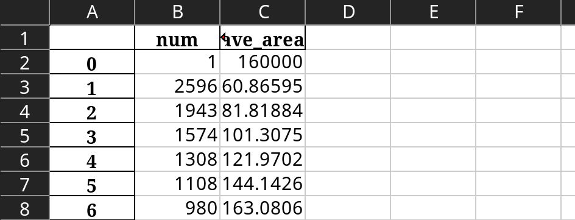

# 晶粒检测计数

此项目用于计算机生成晶粒图像的自动检测与计数。

## 案例展示

```shell
python ./src/main.py ./exampledata
```

python 为当前环境下的编译器

main.py 为脚本

example_data 为案例数据所在路径， 是提供给main.py 的参数

输出 output.xlsx， 如图



## 说明

脚本的执行存在依赖的环境，需要配置环境才能保证代码成功执行

## 环境配置

该项目为非开源项目，首先请求管理员添加仓库权限，再完成下列配置。

### Linux

依赖:

1. Git

2. python3

```shell
# ubuntu
sudo apt-get install git
sudo apt-get install python3 

mkdir path/to/project
git clone https://github.com/yuc12en/normal_grain_detection.git  path/to/project  # 使用token登录
git clone git@github.com:yuc12en/normal_grain_detection.git path/to/project  # 使用ssh登录
```


由于在很多情况下，下载服务器位于境外，下载速度过慢导致安装失败，如果出现，解决思路有两种

1. 使用代理
2. 使用国内镜像

在其他环境如果出现下载速度过慢，也请尝试两者其中之一，具体操作请自行搜索

#### 虚拟环境

如果你

1. 计算机仅有且保证未来仅有此项目

2. 使用pycharm 等自动管理虚拟环境的IDE

请略过此节

虚拟环境是为了保证不同项目之间的依赖版本不存在冲突。例如项目A依赖程序p-1.0版本，而项目B依赖程序p-2.0版本，如若全局安装项目A、再安装项目B，如果对于程序p的依赖无法兼容，在最后一个项目的构建时，会删去旧（新）版本，导致其他项目的崩溃。

解决方法是使用虚拟环境，将不同项目的依赖程序隔离。python的虚拟环境有许多实现手段，这里推荐venv

```shell
python -m venv path/to/project
cd path/to/project

source bin/activate  # 启动虚拟环境
deactivate  # 退出虚拟环境
```

#### Python 依赖库的安装

在虚拟环境下或使用全局环境下（即不使用虚拟环境），进行python依赖的安装

```shell
pip install -r requirements.txt
```

Linux 环境配置完毕


### windows

可以使用

1. Msys2
2. WSL

等模拟Linux环境，操作则与上述相同

或使用

1. Git for windows
2. Python3

上述两者在windows除下载安装外需要进行环境变量的设置

> 环境变量
>
> 即系统内储存的变量，例如存储了A=1，那么在命令行下，输入命令echo $A，则会返回数字1.
>
> 在windows中，需要修改的是PATH环境变量，它实质上是许多目录，告诉系统可执行文件的目录（在此处为git， python）。
>
> 如果不修改，在每次调用这些程序时，都需要显性地声明它们所在的路径，没人想这么做

请自行搜索如何设置两者的windows环境变量。

#### powershell

无论是设置虚拟环境，还是安装python 依赖库文件，都可以通过pycharm等IDE的图形化窗口进行。具体操作可以搜索。如果需要使用命令行环境，推荐windows下自带powershell， 当你配置好了环境变量，只考虑本项目的话，和linux系统需要的操作没有区别。

由于pycharm每个库都需要手动搜索、确认版本、再点击下载，因此还是推荐使用powershell，命令与Linux下配置虚拟环境与安装python库的命令一致。

安装完依赖后，windows下的配置就完成了。

### 补充

环境配置中，遇到报错是很正常的，大部分报错仔细读一读报错信息就知道怎么解决了。如果仍然未能解决，复制关键报错信息与源代码进行搜索，能够解决99%的问题。
